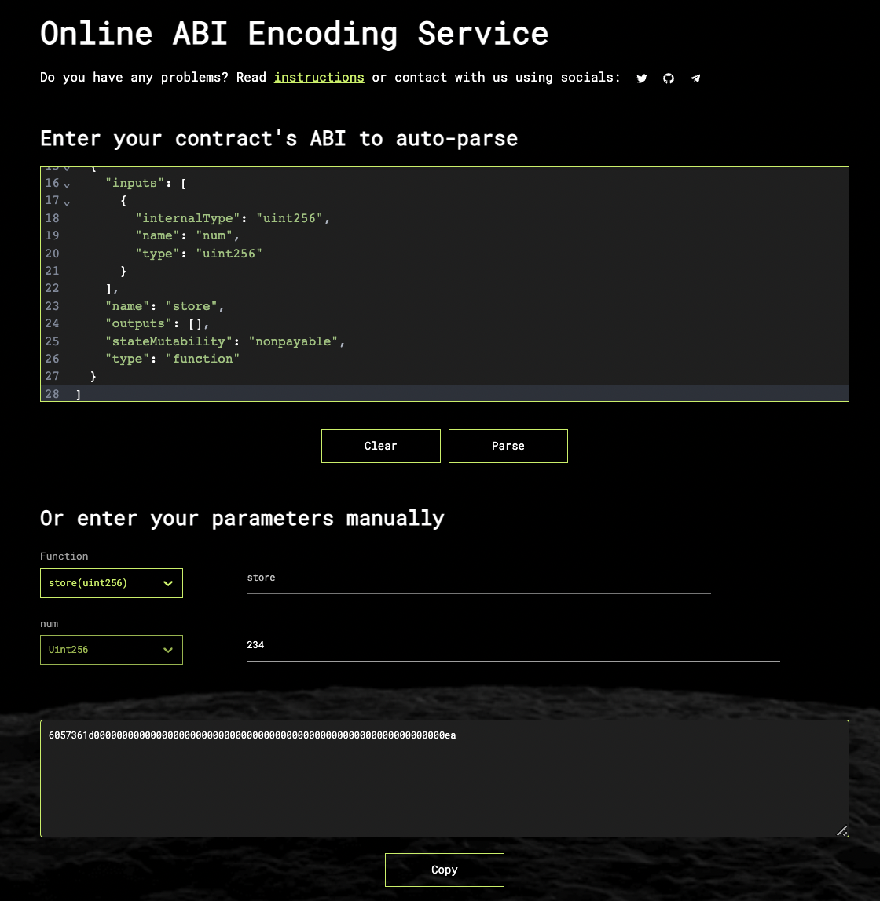

# Execute EVM smart contracts from Paloma
With Paloma, you can execute smart contracts that are deployed on [any supported EVM chain.](../../resources/networks) This is done in two steps by first defining a job and then executing it on Paloma. Remote execution can be done using CosmWasm smart contracts or directly using palomad. The below steps use `palomad` CLI commands for demonstration purposes. To see some examples of CosmWasm contracts take a look at Github [here](https://github.com/palomachain/cross-chain-amm-cosmwasm/blob/main/src/contract.rs) and [here](https://github.com/palomachain/paloma-rs/tree/main/egg).

## Prepare your EVM compatible smart contract for execution 
Before defining the job, you need to ensure that your smart contract is good to go. 

1. Deploy your EVM compatible contract on the Paloma supported target chain. See currently active chains [here.](../../resources/networks.md)
2. Allow Paloma's [Compass-EVM contract](../applications/compass-evm/overview.md) to run the functions that you want to execute. The available contract addresses are listed [here.](../../resources/networks.md)

::: warning
Anybody can currently use Paloma to send a message to Paloma's Compass EVM and target your EVM contract. Don't use this functionality for anything that you don't want anybody to be able to run.
:::

## Create the Job

To create the job, you'll need to define the following parameters: 
- `job-id` string that you chose as name for the job
- `chain-type` e.g. EVM
- `chain-ref-id` the chain the contract your sending a message to is deployed on
- `definition` path to json file containing the escaped `abi` and address of the contract you're sending a message to
- `payload` path to job's default json file containing the payload of your message in HEX encoding. This can be empty, but then the `payload-mofifiable` flag must be set
- `payload-modifiable` if set to true, the payload can be changed when executing the job

### Example
Here is an example for creating a job called demo to be executed on Binance Mainnet for [this example contract.](https://bscscan.com/address/0x1f576f2021b6ebdf229750f54fdfd31206141e65) In this case we want to update the storage variable to 234.

#### `definition` - definition.json
```json
{
   "abi": "[{\"inputs\":[],\"name\":\"retrieve\",\"outputs\":[{\"internalType\":\"uint256\",\"name\":\"\",\"type\":\"uint256\"}],\"stateMutability\":\"view\",\"type\":\"function\"},{\"inputs\":[{\"internalType\":\"uint256\",\"name\":\"num\",\"type\":\"uint256\"}],\"name\":\"store\",\"outputs\":[],\"stateMutability\":\"nonpayable\",\"type\":\"function\"}]",
   "address": "0x51eca2efb15afacc612278c71f5edb35986f172f"
}
```
::: tip
User `jq` or an [online tool](https://www.freeformatter.com/json-escape.html) to escape your contracts ABI
:::

#### `payload` - payload.json
```json
{
  "hexPayload":"6057361d00000000000000000000000000000000000000000000000000000000000000ea"
}
```
::: details How to retrieve the payload
If you're retrieving the payload manually, you can use this [online tool](https://abi.hashex.org/) to generate the hex encoding of your payload. Simply chose the function and value that you're aiming to update. 

:::

#### Schedule the job
```bash
palomad tx scheduler create-job \
  --job-id <your job name> \
  --chain-type evm \
  --chain-ref-id bnb-main \
  --definition definition.json \
  --payload payload.json \
  --payload-modifiable=true \
  --from <your paloma address> \
  --gas auto --fees 300ugrain -b sync
```


## Execute the Job
Once you have defined your job, you can execute your job by simply referencing the job id you chose. Optionally, (if `modifiable` was set to true) you can pass in the `payload` again. If not set, it will default to the default payload.

In our example from above, this would look like this:

```sh 
palomad tx scheduler execute-job  <your job name> \
  --from <your paloma address> \
  --gas auto --fees 300ugrain -b sync
```

