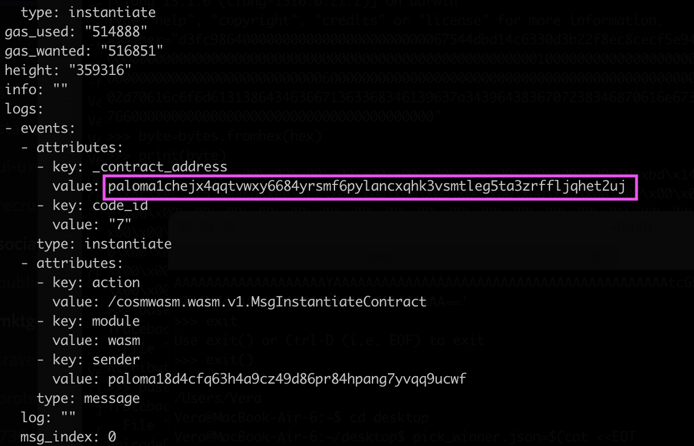
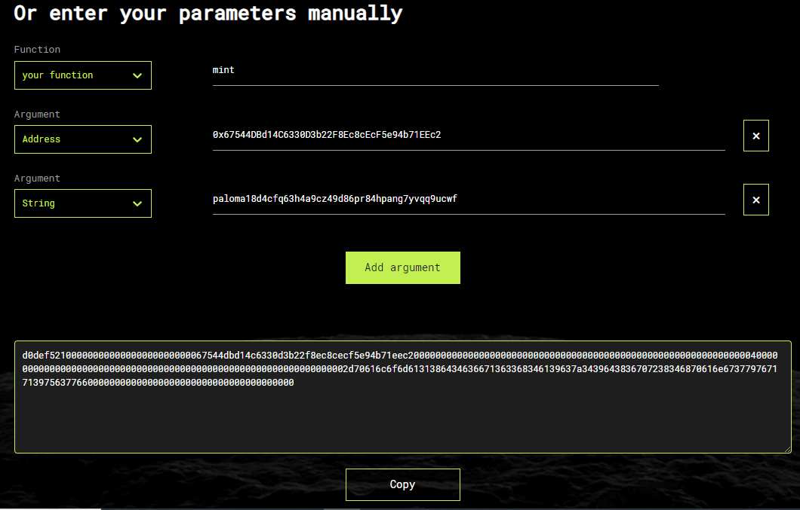

<p align="center">

</p>

# Mint an Egg NFT on Ethereum Mainnet

You can mint an Egg NFT on Ethereum from Paloma by running the bash scripts. Follow the steps here to guide you through the process.


## Prerequisites
This requires that you have a access to a node on which you can run `palomad`. Follow the setup guide [here](./palomad/install-palomad.md).
All scripts below, must be run on the machine that is running your Paloma node.


## Set your variables
First set the Paloma chain id you're on as well as your paloma wallet address as well as the Ethereum address that should receive the NFT

```sh
export ADDRESS=<Your Paloma Address>
export PALOMA_CHAIN_ID=<paloma chain id>
export ETH_ADDRESS=<your Ethereum wallet address>
```


## Instantiate the CosmWasm contract
Run the script below on your Paloma node to instantiate the egg contract that is deployed on Paloma.

```sh
#!/bin/bash
set -euo pipefail
set -x

#set the parameters for the JSON
CHAIN_ID="eth-main"
COMPASS_ID="50"
CONTRACT_ADDRESS="0x4d746e8f7567d3bdaf64c0c366e6517b3cbe2acf"
SMART_CONTRACT_ABI='[{"type": "event", "name": "Transfer", "inputs": [{"name": "_from", "type": "address", "indexed": true}, {"name": "_to", "type": "address", "indexed": true}, {"name": "_tokenId", "type": "uint256", "indexed": true}], "anonymous": false}, {"type": "event", "name": "Approval", "inputs": [{"name": "_owner", "type": "address", "indexed": true}, {"name": "_approved", "type": "address", "indexed": true}, {"name": "_tokenId", "type": "uint256", "indexed": true}], "anonymous": false}, {"type": "event", "name": "ApprovalForAll", "inputs": [{"name": "_owner", "type": "address", "indexed": true}, {"name": "_operator", "type": "address", "indexed": true}, {"name": "_approved", "type": "bool", "indexed": false}], "anonymous": false}, {"type": "event", "name": "Minted", "inputs": [{"name": "eth_address", "type": "address", "indexed": true}, {"name": "paloma_address", "type": "string", "indexed": true}, {"name": "token_id", "type": "uint256", "indexed": true}], "anonymous": false}, {"type": "event", "name": "SetMinter", "inputs": [{"name": "new_minter", "type": "address", "indexed": true}, {"name": "old_minter", "type": "address", "indexed": true}], "anonymous": false}, {"type": "constructor", "stateMutability": "nonpayable", "inputs": []}, {"type": "function", "name": "name", "stateMutability": "nonpayable", "inputs": [], "outputs": [{"name": "", "type": "string"}]}, {"type": "function", "name": "symbol", "stateMutability": "nonpayable", "inputs": [], "outputs": [{"name": "", "type": "string"}]}, {"type": "function", "name": "supportsInterface", "stateMutability": "pure", "inputs": [{"name": "interface_id", "type": "bytes4"}], "outputs": [{"name": "", "type": "bool"}]}, {"type": "function", "name": "balanceOf", "stateMutability": "view", "inputs": [{"name": "_owner", "type": "address"}], "outputs": [{"name": "", "type": "uint256"}]}, {"type": "function", "name": "ownerOf", "stateMutability": "view", "inputs": [{"name": "_tokenId", "type": "uint256"}], "outputs": [{"name": "", "type": "address"}]}, {"type": "function", "name": "getApproved", "stateMutability": "view", "inputs": [{"name": "_tokenId", "type": "uint256"}], "outputs": [{"name": "", "type": "address"}]}, {"type": "function", "name": "isApprovedForAll", "stateMutability": "view", "inputs": [{"name": "_owner", "type": "address"}, {"name": "_operator", "type": "address"}], "outputs": [{"name": "", "type": "bool"}]}, {"type": "function", "name": "transferFrom", "stateMutability": "nonpayable", "inputs": [{"name": "_from", "type": "address"}, {"name": "_to", "type": "address"}, {"name": "_tokenId", "type": "uint256"}], "outputs": []}, {"type": "function", "name": "safeTransferFrom", "stateMutability": "nonpayable", "inputs": [{"name": "_from", "type": "address"}, {"name": "_to", "type": "address"}, {"name": "_tokenId", "type": "uint256"}], "outputs": []}, {"type": "function", "name": "safeTransferFrom", "stateMutability": "nonpayable", "inputs": [{"name": "_from", "type": "address"}, {"name": "_to", "type": "address"}, {"name": "_tokenId", "type": "uint256"}, {"name": "_data", "type": "bytes"}], "outputs": []}, {"type": "function", "name": "approve", "stateMutability": "nonpayable", "inputs": [{"name": "_approved", "type": "address"}, {"name": "_tokenId", "type": "uint256"}], "outputs": []}, {"type": "function", "name": "setApprovalForAll", "stateMutability": "nonpayable", "inputs": [{"name": "_operator", "type": "address"}, {"name": "_approved", "type": "bool"}], "outputs": []}, {"type": "function", "name": "mint", "stateMutability": "nonpayable", "inputs": [{"name": "_to", "type": "address"}, {"name": "_tokenId", "type": "uint256"}, {"name": "_paloma_address", "type": "string"}], "outputs": [{"name": "", "type": "bool"}]}, {"type": "function", "name": "set_minter", "stateMutability": "nonpayable", "inputs": [{"name": "_minter", "type": "address"}], "outputs": []}, {"type": "function", "name": "tokenURI", "stateMutability": "view", "inputs": [{"name": "tokenId", "type": "uint256"}], "outputs": [{"name": "", "type": "string"}]}, {"type": "function", "name": "minter", "stateMutability": "view", "inputs": [], "outputs": [{"name": "", "type": "address"}]}]'


# Escape the ABI json.
SMART_CONTRACT_ABI="$(echo "$SMART_CONTRACT_ABI" | jq -R -s .)"

JSON="$(cat <<EOT
{
  "target_contract_info": {
    "chain_id": "$CHAIN_ID",
    "compass_id": "$COMPASS_ID",
    "contract_address": "$CONTRACT_ADDRESS",
    "smart_contract_abi": $SMART_CONTRACT_ABI
  }
}
EOT
)"


#palomad command to instantiate the contract
exec palomad tx wasm instantiate 7 \
"$JSON" \
--from "$ADDRESS" \
--fees 400ugrain \
--label "egg-contest" \
--chain-id "$PALOMA_CHAIN_ID" \
--gas auto \
-y --no-admin -b block
```

After you run the script with `bash`, you will be prompted to enter your keyring password and should see new contract address in the `palomad` output. 

:::details Sample output for contract instantiation
Here are the last few lines of the `palomad ` output for instantiating a contract. The contract address is marked with the box.

:::


Next, set the variable for the contract you just instantiated

```sh
export EGG_CONTRACT=<Address of contract you instantiated>
```

## Lay an Egg
Run the script below on your Paloma node using `bash` to "lay an egg". This is done by executing the `LayEgg` smart contract function of the `EGG_CONTRACT`. 

```sh
#!/bin/bash
set -euo pipefail
set -x

JSON=$(cat <<EOT
{
  "lay_egg": {
    "eth_address": "$ETH_ADDRESS"
  }
}
EOT
)

palomad tx wasm execute \
"$EGG_CONTRACT" \
"$JSON" \
--amount 1000000ugrain \
--chain-id "$PALOMA_CHAIN_ID" \
--from "$ADDRESS" \
--fees 400ugrain \
--gas auto \
-y -b block
```

## Determine the payload for the Vyper contract
In the last step below, we'll need to pass the payload in base64 format in the smart contract execution. 

This can be done in two simple steps. 

### Get payload in Hex
Use this [online tool](https://abi.hashex.org/) get the hex version here. You'll need to pass in the following parameters:
- Function - your function --> mint
- Argument - Address --> Your ethereum address
- Argument - Uint --> 1
- Argument - String --> Your Paloma address

:::details Example of Hex generation

:::

### Convert to byte array
Now that you have the payload in Hex format, you need to convert it into base64 usin this [tool](https://base64.guru/converter/encode/hex).

:::details Using Python for the conversion
Python also makes it easy to convert Hex into base64 as per the steps below.
```py
import base64

HEX_STRING = '<your hex>'

BYTE_ARRAY = bytearray.fromhex(HEX_STRING)
print(BYTE_ARRAY)
BASE64_VAL = base64.b64encode(BYTE_ARRAY)
print(BASE64_VAL)
```
:::

## Mint the Egg on Ethereum
Last, but not least, it's time to mint the egg by executing the `PickWinner` smart contract function. This will result in a `SubmitLogicCall` on [Compass EVM](./applications/compass-evm.md) that is relayed by the Pigeons to Ethereum.

create a JSON file with the payload from above and export the variable
```sh
cat <<EOT > pick_winner.json
{
  "pick_winner": {"payload": "<base64 value>"  }
}
EOT
)

export JSON=pick_winner.json
```

Copy and run the script below on your Paloma node using `bash`.

```sh
#!/bin/bash
set -euo pipefail
set -x

palomad tx wasm execute \
"$EGG_CONTRACT" \
"$JSON" \
--chain-id "$PALOMA_CHAIN_ID" \
--from "$ADDRESS" \
--fees 400ugrain \
--gas auto \
-y -b block
```

**Congratulations, you have now minted and egg! Check your Ethereum wallet to see the NFT there.**