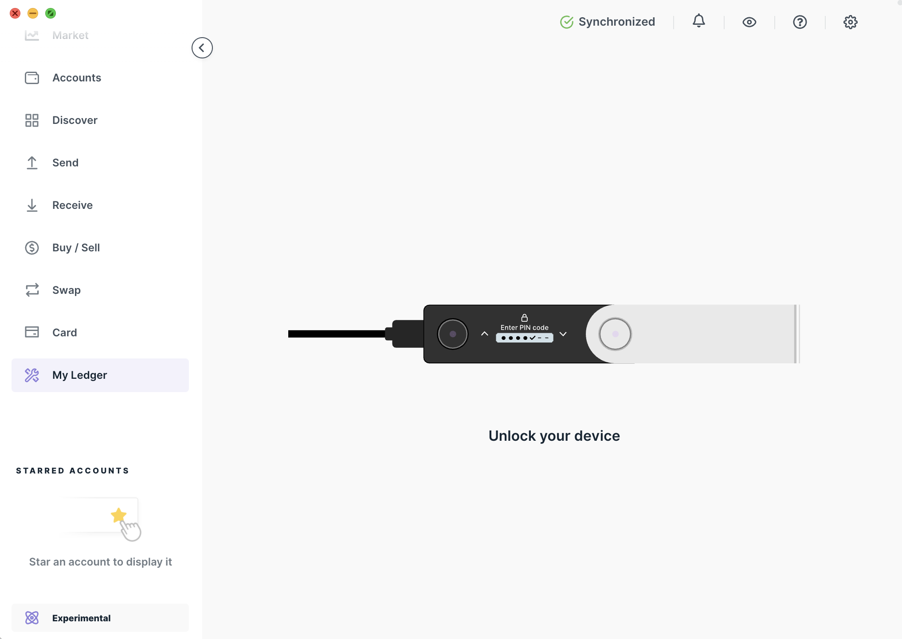
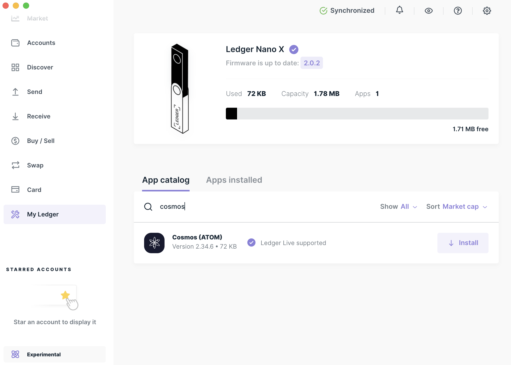

# Ledger Nano Support for Paloma

Using a hardware wallet to store your keys greatly improves the security of your crypto assets. The Ledger device acts as an enclave of the seed and private keys, and the process of signing transaction takes place within it. No private information ever leaves the Ledger device. The following is a short tutorial on using the Cosmos Ledger app with the Paloma CLI.

At the core of a Ledger device there is a mnemonic seed phrase that is used to generate private keys. This phrase is generated when you initialize you Ledger. The mnemonic is compatible with Paloma and can be used to seed new accounts.

::: danger
Do not lose or share your 24 words with anyone. To prevent theft or loss of funds, it is best to keep multiple copies of your mnemonic stored in safe, secure places. If someone is able to gain access to your mnemonic, they will fully control the accounts associated with them.
:::

## Install the Cosmos Ledger application

Installing the `Cosmos` application on your ledger device is required before you can use Ledger with `palomad`. To do so, you need to:

1. Install [Ledger Live](https://shop.ledger.com/pages/ledger-live) on your desktop machine.
2. Using Ledger Live, [update your Ledger device with the latest firmware](https://support.ledger.com/hc/en-us/categories/4404376139409-Documentation-?docs=true).
3. On the Ledger Live application, [navigate to `My Ledger` in the left panel menu](https://support.ledger.com/hc/en-us/articles/4404382258961-Install-uninstall-and-update-apps?docs=true).
    
4. Connect your Ledger device and unlock it.
5. Press both buttons on your Ledger device to allow Ledger Live on your device.
5. On the Ledger Live application, search for `Cosmos`.
    
6. Install the Cosmos application by clicking on `Install`.

::: tip
To see the `Cosmos` application when you search for it, you might need to activate the `Developer Mode`, located in the Experimental features tab of the Ledger Live application.
:::


## Install palomad with Ledger Support
To install  `palomad` with Ledger support, you'll need to build the binary from source.

1. [Install Golang.](https://golang.org/doc/install)
2. [Install Git.](https://git-scm.com/downloads)
3. Clone the paloma github repository. In your computer's terminal run the following command:
   
```
git clone https://github.com/palomachain/paloma
```
4. Confirm and check out the [<latest_tag> for Paloma](https://github.com/palomachain/paloma/releases/latest) in the cloned `paloma` directory. 

```
cd paloma
git checkout <latest_tag>
```

For example if the latest tag is `v1.0.0` the command would be

```
git checkout v1.0.0
```

5. Install `palomad`.

```
LEDGER_ENABLED=true make build
sudo mv ./build/palomad /usr/local/bin/palomad
```

6. Verify that `palomad` is installed correctly with the following command. The build commit should match the latest commit on the tag as shown on Github.

```bash
palomad version --long
```

The end of the output should look like this and allows to confirm the Version.
```
...
build_tags: netgo,ledger
commit: 869235eb3e3ea2e4e97281b048f2263eb11081de
cosmos_sdk_version: v0.47.4
go: go version go1.19.4 darwin/amd64
name: paloma
server_name: palomad
version: 1.0.0
```


## Create a Paloma address with Ledger

Prerequisites for this section
1. [Install the Cosmos app.](#install-the-cosmos-ledger-application) on your Ledger Nano
2. [Install Paloma with Ledger Support.](#install-paloma-with-ledger-support) 

### Add your Ledger key
- Connect and unlock your Ledger device.
- Open the Cosmos app on your Ledger.
- Create an account in palomad from your Ledger key.

::: tip
Be sure to change the _keyName_ parameter to be a meaningful name. The `ledger` flag tells `palomad` to use your Ledger to seed the account.
:::

```bash
palomad keys add <keyName> --ledger
```

The output after the above command will look like this:
```bash
➜ NAME: TYPE: ADDRESS:     PUBKEY:
<keyName> ledger paloma1... palomapub1...
```

Cosmos uses [HD Wallets](https://hub.cosmos.network/main/resources/hd-wallets.html). This means you can setup many accounts using the same Ledger seed. To create another account from your Ledger device, run (change the integer i to some value >= 0 to choose the account for HD derivation). You'll only need to specify the account number during account creation, for other transactions the keyName is sufficient:

```bash
palomad keys add <secondKeyName> --ledger --account <i>
```

### Confirm your address

Run this command to display your address on the device. Use the `keyName` you gave your ledger key.

```bash
palomad keys show <keyName> -d
```

Confirm that the address displayed on the device matches that displayed when you added the key.

## Connect to a full node

Next, you need to configure palomad with the URL of a Paloma full node and the appropriate `chain-id`. In this example we connect to the public load balanced full node operated by Volume on the `messenger` mainnet chain. But you can point your `palomad` to any Paloma full node. **Be sure that the `chain-id` is set to the same chain as the full node. See the list of active `chain-id`s [here](./networks).**

```bash
palomad config node https://rpc.palomachain.com:443
palomad config chain-id messenger
```

Test your connection with a query such as:

``` bash
palomad query staking validators
```

::: tip
To run your own full node locally [read more here](../maintain/node/requirements).
:::

## Some helpful CLI commands 

### Sign a Ledger transaction

You are now ready to start signing and sending transactions. Send a transaction with palomad using the `tx send` command.

``` bash
palomad tx bank send --help # to see all available options.
```

::: tip
Be sure to unlock your device with the PIN and open the Cosmos app before trying to run these commands
:::

Use the `keyName` you set for your Ledger key and gaia will connect with the Cosmos Ledger app to then sign your transaction.

```bash
palomad tx bank send <keyName> <destinationAddress> <amount>ugrain --gas auto --fees 300ugrain
```

When prompted with `confirm transaction before signing`, Answer `Y`.

Next you will be prompted to review and approve the transaction on your Ledger device. Be sure to inspect the transaction JSON displayed on the screen. You can scroll through each field and each message. Scroll down to read more about the data fields of a standard transaction object.

<!-- Now, you are all set to start [sending transactions on the network](delegators guide to sending transactions). -->

### Receive funds

To receive funds to the Cosmos account on your Ledger device, retrieve the address for your Ledger account (the ones with `TYPE ledger`) with this command:

```bash
palomad keys list

➜ NAME: TYPE: ADDRESS:     PUBKEY:
<keyName> ledger palomad1... palomapub1...
```

### Check your wallet balance

Run this command to check your wallet balance

``` bash
palomad q bank balances <your Paloma wallet address>
```


### Further documentation

Not sure what `palomad` can do? Take a look at [commands documentation](../develop/palomad/commands) or simply run the command without arguments to output documentation for the commands in supports.

::: tip
The `palomad` help commands are nested. So `$ palomad` will output docs for the top level commands (status, config, query, and tx). You can access documentation for sub commands with further help commands.

For example, to print the `query` commands:

```bash
palomad query --help
```

Or to print the `tx` (transaction) commands:

```bash
 tx --help
```

:::

## The Cosmos Standard Transaction

Paloma transactions follow the [Standard Transaction type](https://godoc.org/github.com/cosmos/cosmos-sdk/x/auth#StdTx) from the Cosmos SDK. The Ledger device displays a serialized JSON representation of this object for you to review before signing the transaction. Here are the fields and what they mean:

- `chain-id`: The chain to which you are broadcasting the tx. Find the available chain-ids [here](./networks). 
- `account_number`: The global id of the sending account assigned when the account receives funds for the first time.
- `sequence`: The nonce for this account, incremented with each transaction.
- `fee`: JSON object describing the transaction fee, its gas amount and coin denomination
- `memo`: optional text field used in various ways to tag transactions.
- `msgs_<index>/<field>`: The array of messages included in the transaction. Double click to drill down into nested fields of the JSON.

## Support

For further support, start by looking over the posts in our [Paloma forum.](https://forum.palomachain.com/)

Feel welcome to reach out in our [Discord Channel](https://discord.gg/HtUvgxvh5N) to ask for help.